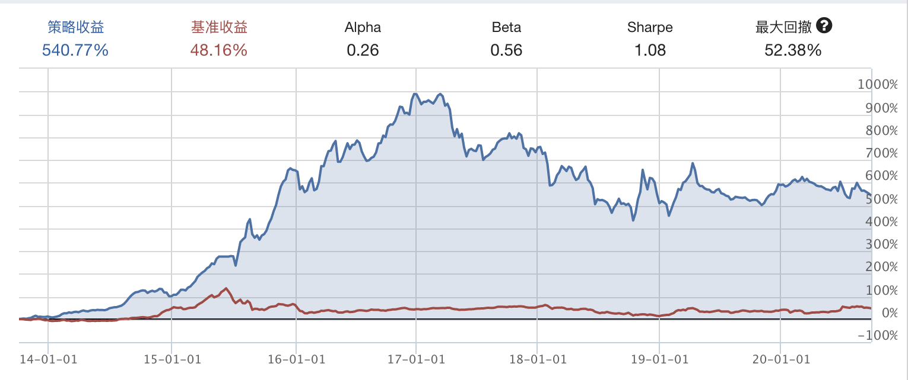
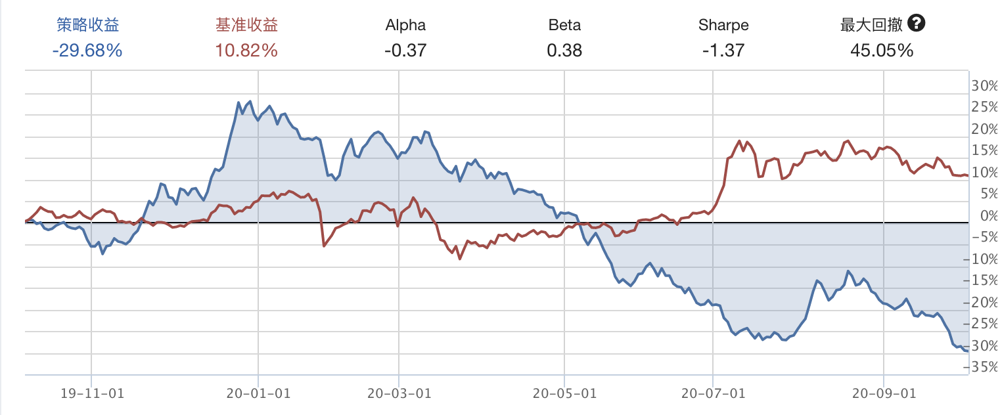

小市值策略
---

> 该策略持仓市场中市值最小的一些股票，在一定时间之后将持仓的非小市值股票卖出，重新买入市值最小的一些股票。

因为小市值股票通常有极大的概率在后续的市场发展中市值大涨，因此其投机盈利利润也较高。但是随着A股注册制的实施，以及市场监管机制的完善，小市值策略在2017年之后的实际收益率并不高，甚至是在不断下降。另外，市场中小市值股票也面临着退市、发展不佳等较大的风险。

---

### 一、我的实验逻辑

在我的策略中，以沪深300指数作为基准进行比较，选取A股市场中市值最小的10支股票，每30天调仓一次，如果持仓的股票不再是市场中市值最小的10支股票之一，则平仓，同时买入新的市值最小的股票。初始资金为10w

#### 1. 测试时间：2013-10-04至2020-10-03
    策略收益：540.77%，最大回撤：52.38%

    

    从上图可见，从2017年之后，该策略收益率便开始逐步下降。

#### 2. 测试时间：2019-10-04至2020-10-03
    策略收益率：-29.68%，最大回撤：45.05%

    这次更惨，2020年5月之后，完全没有收益，之后一路亏损。

